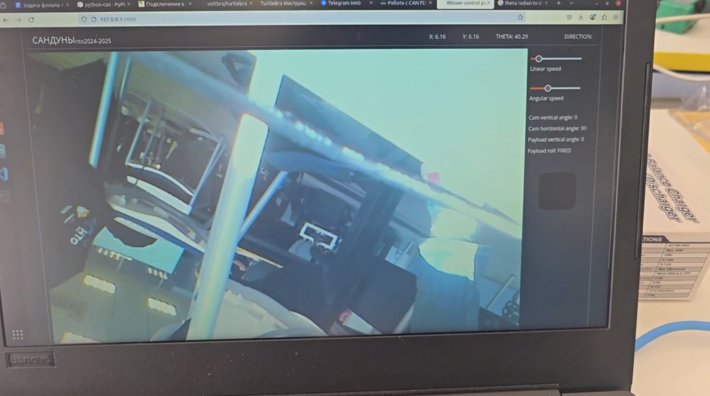

# AKS-2025

---
A solution developed to solve the case of the National Technology Olympiad (Национальная Технологическая Олимпиада) in the profile "Aerospace systems"

---
**Task:** to develop a payload and software for a space rover to solve the problem of deploying solar panels in an unknown area.
To control a space mission to another planet, it is necessary to use both autonomous control elements and remote control without direct visibility using the rover's external sensors.
The team of participants must program the space rover so that it autonomously leaves the landing module, and also in remote control mode gets to the area specified by the coordinates, deploys solar panels there and returns back to the landing module.

**Stages of project:**
1. Modeling and assembling the payload. Attaching it to the rover.
2. Writing a low-level program to manage the payload.
3. Raspberry pi to stm32 microcontroller communication using CAN FD protocol.
4. development of a graphical interface for controlling the movement of the rover and payload, as well as outputting a video stream from the camera and other necessary data

**Problems and their solutions:**
One of the main problems in implementing the control interface was the impossibility of running scripts using the rospy framework on raspberry pie. This did not allow combining the graphical interface program into 1 script for effective payload management as well as rover movement. 

To solve this problem, it was decided to split the program into 2 Flask servers. The first was launched on a laptop, providing a graphical shell and processing requests for rover movement and receiving its odometry. The second server was launched on raspberry pi and received requests from the first for payload management, connecting to stm32 via CAN FD. 

Despite some delay in signal transmission, this method solved the problem and demonstrated its efficiency during test runs.

---

Rover and payload model:

Graphical interface in real use:

